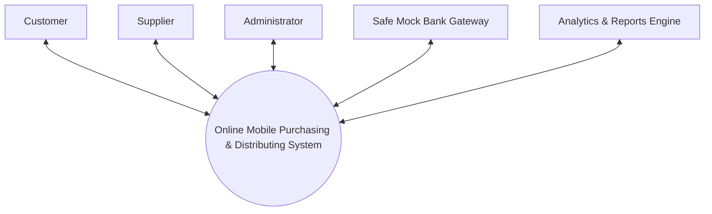

# Online Mobile Purchasing & Distributing System

[](https://www.php.net/)
[](https://www.mysql.com/)
[](https://getbootstrap.com/)
[](https://www.apachefriends.org/)
[](#)

A complete, production-grade, database-driven web application built with **native modular PHP 8+ and MySQL**, engineered specifically according to formal **Data Flow Diagram (DFD) specifications** and an Indian e-commerce aesthetic inspired by **Flipkart** (Indian Rupee `₹`, 18% GST calculations, free delivery thresholds, stock reservation holds, and live consignment tracking).

---

## 📑 Table of Contents
1. [Architectural Overview & DFD Compliance](#-architectural-overview--dfd-compliance)
2. [Key Features](#-key-features)
3. [Technology Stack](#-technology-stack)
4. [Directory Structure](#-directory-structure)
5. [Installation & XAMPP Setup Guide](#-installation--xampp-setup-guide)
6. [Administrator Credentials](#-administrator-credentials)
7. [Automated Verification & Test Suite](#-automated-verification--test-suite)
8. [DFD Interactive Visualizer](#-dfd-interactive-visualizer)
9. [Security Highlights](#-security-highlights)

---

## 🏛 Architectural Overview & DFD Compliance

The entire codebase is structured to mirror the formal Data Flow Diagrams required in enterprise software engineering and academic project defense:

### Level 0: Context Diagram

- **5 External Entities:** Customer, Supplier, Administrator, Bank Payment Gateway, Analytics & Reports Engine.

### Level 1: Functional Decomposition
- **`P1.1 Manage User Accounts`** &rarr; Interacts with **`D1: USER DB`** (`users`, `suppliers`).
- **`P1.2 Catalog & Inventory Management`** &rarr; Interacts with **`D2: PRODUCT DB`** (`categories`, `brands`, `products`, `inventory_transactions`).
- **`P1.3 Order Processing`** &rarr; Interacts with **`D3: ORDERS DB`** (`cart`, `cart_items`, `orders`, `order_items`, `stock_reservations`).
- **`P1.4 Payment & Billing`** &rarr; Interacts with **`D4: BILLING DB`** (`payments`, `invoices`, `invoice_items`).
- **`P1.5 Fulfillment & Tracking`** &rarr; Interacts with **`D5: FULFILLMENT DB`** (`fulfillments`, `shipment_events`).

### Level 2: Critical Sub-Processes
- **`P1.3.1 Verify Order:`** Real-time validation of warehouse inventory preventing overselling.
- **`P1.3.2 Calculate Sub-total:`** Computes 18% GST tax, itemized line totals, promo code deductions, and applies free delivery for orders &ge; ₹5,000.
- **`P1.3.3 Reserve Stock:`** Locks requested quantity with a 15-minute Time-To-Live (TTL) reservation hold (`stock_reservations`), preventing race conditions while the customer authenticates with the payment gateway.
- **`P1.4.1 Verify Customer Authentication:`** Generates a cryptographically signed HMAC token for payment session isolation.
- **`P1.4.2 Process Gateway Authorization:`** Safe Mock Bank Gateway processing UPI, Debit/Credit Card with simulated OTP verification, or Net Banking.
- **`P1.4.3 Generate GST Tax Invoice:`** On payment success, commits reservation, decrements stock atomically, and creates itemized tax invoices (`INV-XXXX`). On payment failure or cancellation, releases reserved stock back to the public catalog.

---

## ✨ Key Features

### 🛒 Customer Storefront (Flipkart-Inspired UI)
- **Faceted Product Filtering:** Instant live search, brand checkboxes, RAM (4GB–16GB), storage (64GB–1TB), price sliders, customer rating filters, and in-stock toggles.
- **Detailed Product Showcase:** High-resolution vector device renders, key technical specifications table, verified buyer reviews, and 5-star ratings.
- **AJAX Shopping Cart:** Dynamic quantity adjustment, stock limit enforcement, and instant price breakdown calculation.
- **Stock Reservation Checkout:** Secure 15-minute inventory hold with countdown timer and promo code engine (e.g. `WELCOME500`, `FESTIVE10`).
- **Safe Mock Bank Gateway:** Complete interactive simulator supporting UPI QR, credit/debit card with simulated OTP modal, and quick evaluator testing buttons (`Test Success`, `Test Decline`, `Test Cancel`).
- **Live Consignment Tracking (Ekart Style):** Multi-step visual tracking stepper (`ORDER_CONFIRMED` &rarr; `PROCESSING` &rarr; `PACKED` &rarr; `SHIPPED` &rarr; `IN_TRANSIT` &rarr; `OUT_FOR_DELIVERY` &rarr; `DELIVERED`) with checkpoint events and estimated arrival.
- **Printable Tax Invoices:** Dedicated invoice view with `@media print` styling, GST breakdown, HSN classification, and supplier details.

### 🏭 Supplier Portal (`/supplier/`)
- **Supplier Dashboard:** Real-time metrics on assigned products, low-stock warnings, inward receipts, and total sales volume.
- **Product Catalog Management:** Add/edit smartphone models, technical specifications, variants, and pricing.
- **Inventory Stock Management:** Adjust inventory levels with audit trails (`INWARD_SUPPLIER`, `CORRECTION`), record supplier batch references, and view restock alerts.
- **Purchase Orders & Shipments:** Manage customer order consignments, assign carrier tracking numbers, and update shipment progression.

### 🛡 Admin Control Center (`/admin/`)
- **Executive Dashboard:** Live metrics, monthly revenue trends, order status donuts, and quick actions.
- **User & RBAC Management:** Manage administrators, suppliers, and customers. Approve or reject supplier vendor registrations.
- **Master Catalog & Categories:** Complete CRUD for smartphone models, brands, and categories.
- **Inventory Audit (D2):** Comprehensive warehouse audit trail tracking every single stock movement before and after transactions.
- **Orders & Payments Ledger:** Central pipeline to inspect order progress, gateway transaction IDs, and invoice records.
- **Reviews Moderation:** Approve or reject customer product reviews.
- **Coupons & Promotions:** Create fixed discount or percentage-based promo codes with minimum order limits and validity dates.
- **System Governance & Logs:** System settings editor (site name, GST rate %, shipping threshold, reservation hold minutes) and complete immutable activity audit trail.

### 📊 Analytics & Reports Engine (`/admin/analytics.php` & `reports.php`)
- **Chart.js Visualizations:** Monthly GMV run-rate, order volume trends, top performing smartphone models by units sold, and payment method split.
- **Financial Reports & CSV Export:** Date-filtered sales ledger with one-click download to CSV formatted for Excel.

---

## 💻 Technology Stack

| Layer | Technologies Used |
|---|---|
| **Backend** | Native PHP 8.0+ (Strict typed PDO, Session RBAC, Zero external frameworks) |
| **Database** | MySQL 5.7+ / 8.0+ or MariaDB 10.3+ (InnoDB, UTF-8 Unicode, Foreign Keys, Indexes) |
| **Frontend** | HTML5, CSS3, JavaScript (ES6+), Bootstrap 5.3.3, Font Awesome 6.5.1 |
| **Data Visuals** | Chart.js 4.4.2 (Analytics), Mermaid.js (Interactive DFDs) |
| **Server** | Apache (XAMPP / WAMP / Native Linux / Windows) |

---

## 📁 Directory Structure

```
PATU/
├── admin/                      # Administrator Portal (P1.1, P1.2, P1.3, P1.4, P1.5)
│   ├── analytics.php           # Deep-dive Chart.js business analytics
│   ├── categories.php          # Categories and brands management
│   ├── customers.php           # Registered customer accounts
│   ├── dashboard.php           # Central KPI dashboard
│   ├── fulfillment.php         # Master fulfillment dispatch pipeline
│   ├── header.php / footer.php # Reusable admin layout
│   ├── inventory.php           # Warehouse inventory audit trail
│   ├── invoices.php            # Repository of generated invoices
│   ├── logs.php                # Security and activity audit ledger
│   ├── orders.php              # Orders management
│   ├── payments.php            # Payments ledger (D4)
│   ├── products.php            # Master product catalog CRUD
│   ├── promotions.php          # Coupons and promo code engine
│   ├── reports.php             # Sales reports & CSV export
│   ├── reviews.php             # Customer review moderation
│   ├── settings.php            # Global business rules & settings
│   ├── suppliers.php           # Supplier vendor approval workflow
│   └── users.php               # System user directory
│
├── api/                        # REST-style JSON Endpoints
│   ├── cart.php                # AJAX Cart Add, Update, Remove, Count
│   ├── orders.php              # Order summary JSON query
│   ├── products.php            # Autocomplete search endpoint
│   └── tracking.php            # Live consignment status endpoint
│
├── assets/                     # Frontend Assets
│   ├── css/                    # Custom CSS, Flipkart theme, Admin theme
│   ├── js/                     # AJAX cart handler, debounced search, toasts
│   └── images/products/        # 16 High-resolution smartphone SVG illustrations
│
├── config/                     # Core Configuration
│   ├── constants.php           # Base URL detection, GST rate, DFD constants
│   ├── database.php            # Singleton PDO connection with XAMPP fallback
│   └── setup.php               # 1-Click web-based database installer
│
├── customer/                   # Customer Storefront & Account Pages
│   ├── cart.php                # Shopping cart interface
│   ├── checkout.php            # Checkout, stock reservation hold (P1.3.3)
│   ├── invoices.php            # Tax invoice view with printable styles
│   ├── order-details.php       # Itemized order breakdown
│   ├── orders.php              # Customer order history
│   ├── product-details.php     # Technical specifications & reviews
│   ├── products.php            # Faceted smartphone catalog
│   ├── profile.php             # Profile, address, & password manager
│   ├── reviews.php             # Customer review history
│   └── tracking.php            # Live visual tracking stepper (P1.5)
│
├── database/                   # Database Schema & Data
│   └── database.sql            # Normalized schema with 16 pre-seeded phones & users
│
├── documentation/              # Architecture & Diagrams
│   └── dfd.php                 # Interactive vector Mermaid.js DFD diagrams
│
├── includes/                   # Reusable Core Helpers
│   ├── auth.php                # RBAC guards & session authentication
│   ├── csrf.php                # CSRF protection tokens
│   ├── dfd_helper.php          # DFD process & data store traceability helper
│   ├── functions.php           # format_inr(), sanitize(), status badges
│   ├── header.php / footer.php # Storefront layout
│   ├── logger.php              # System activity audit logger
│   └── navbar.php              # Responsive Flipkart-style top navigation
│
├── payment/                    # Safe Mock Payment Gateway
│   ├── callback.php            # Payment verification, stock commit/release
│   └── mock_gateway.php        # Interactive Bank Gateway Simulator
│
├── supplier/                   # Supplier Vendor Portal
│   ├── dashboard.php           # Supplier metrics & purchase orders
│   ├── inventory.php           # Stock adjustments & inward receipts
│   ├── orders.php              # Orders pending supplier fulfillment
│   ├── product_add.php         # Add new phone SKU
│   ├── product_edit.php        # Edit phone specs and pricing
│   ├── products.php            # Supplier product inventory
│   ├── profile.php             # Company details & GST info
│   ├── restock.php             # Critical low-stock warning list
│   ├── sales.php               # Supplier sales analytics
│   └── shipments.php           # Dispatch & tracking update
│
├── tests/                      # Automated Verification Test Suite
│   └── test_flows.php          # Dual CLI / Web test runner for all 8 flows
│
├── index.php                   # Storefront Homepage (Carousels, Deals)
├── login.php                   # Unified login (Username/Email & Password)
├── logout.php                  # Session logout handler
├── register.php                # Customer self-registration
├── run.bat                     # 1-Click Server & Browser Launcher
├── run_tests.bat               # 1-Click Automated Test Runner
└── README.md                   # Comprehensive Project Documentation
```

## 🚀 Installation & Setup Guide

### Option A: 1-Click Quick Launcher (`run.bat`) (Fastest)
Simply double-click the **`run.bat`** file in the project root directory:
1. It automatically searches for your PHP installation (in PATH, XAMPP, WAMP, or Laragon).
2. It tests if MySQL is active on port 3306 and alerts you if XAMPP MySQL needs to be started.
3. It starts the local PHP server at `http://localhost:8000/` and immediately opens your default browser!
4. To run automated tests from the terminal, double-click **`run_tests.bat`**.

### Option B: Standard XAMPP Setup
1. **Place Code in XAMPP:**
   Copy the `PATU` folder into your XAMPP `htdocs` directory:
   ```
   C:\xampp\htdocs\PATU\
   ```
2. **Start Services:**
   Open the **XAMPP Control Panel** and click **Start** for both **Apache** and **MySQL**.
3. **1-Click Automatic Database Setup:**
   Open your browser and navigate to:
   ```
   http://localhost/PATU/config/setup.php
   ```
   - Click **"Run Database Setup & Initialize Catalog"**.
   - The installer automatically creates the `online_mobile_distribution` database, creates all InnoDB tables, populates 16 smartphone models, and initializes the PATANJALI administrator account.
4. **Access the Application:**
   Navigate to:
   ```
   http://localhost/PATU/
   ```

### Option B: Manual SQL Import via phpMyAdmin
1. Open `http://localhost/phpmyadmin/`.
2. Click **Import** in the top navigation.
3. Choose the file `database/database.sql` located inside your project folder.
4. Click **Go** to execute the import.
5. Launch `http://localhost/PATU/`.

---

## 🔑 Administrator Credentials

The system comes pre-configured with a master administrator account:

| Role | Username / Email | Password | Access Rights |
|---|---|---|---|
| **Administrator** | `PATANJALI` (or `patanjali@patu.com`) | `PATU1522` | Full access to `/admin/` control center, master catalog, finances, audit logs, categories, brands, and settings. |

New customers can register anytime with their name, mobile, and email via `/register.php`.

---

## 🧪 Automated Verification & Test Suite

The project includes an automated test runner (`tests/test_flows.php`) verifying all 8 core workflows:

1. **Test 1: User Authentication & Role Redirection (DFD P1.1)**
2. **Test 2: Stock Overselling Prevention (DFD P1.3.1)**
3. **Test 3: Stock Reservation Release on Payment Failure (DFD P1.3.3 / P1.4)**
4. **Test 4: Payment Success Stock Deduction, Invoice & Tracking Generation (DFD P1.4 & P1.5)**
5. **Test 5: Inventory Adjustment Audit Logging (DFD P1.2 & D2)**
6. **Test 6: Supplier Shipment Tracking Update (DFD P1.5)**
7. **Test 7: Role-Based Access Control (RBAC) Guard Enforcement**
8. **Test 8: Low Stock Alert Detection Algorithm**

### How to Run Tests:
- **In Browser (Visual Dashboard):** Navigate to:
  ```
  http://localhost/PATU/tests/test_flows.php
  ```
- **Via Command Line (CLI):**
  ```bash
  php tests/test_flows.php
  ```

---

## 🗺 DFD Interactive Visualizer

An interactive architectural documentation page is built directly into the system at:
```
http://localhost/PATU/documentation/dfd.php
```
Featuring live vector diagrams rendered with Mermaid.js:
- **Level 0:** Context Data Flow Diagram (5 external entities).
- **Level 1:** Functional Decomposition (P1.1 through P1.5 and Data Stores D1 through D5).
- **Level 2 (P1.3):** Detailed Order Processing Sub-Processes (P1.3.1, P1.3.2, P1.3.3).
- **Level 2 (P1.4):** Detailed Payment & Billing Sub-Processes (P1.4.1, P1.4.2, P1.4.3).
- **Traceability Matrix:** Complete mapping linking each DFD process to exact PHP files and MySQL tables.

---

## 🔒 Security Highlights
- **Prepared Statements:** 100% of database interactions use PDO prepared statements with parameter binding, eliminating SQL Injection vulnerabilities.
- **CSRF Defense:** State-changing `POST` forms require a cryptographically random session-bound CSRF token (`csrf_field()`, `require_csrf()`).
- **Role-Based Access Control (RBAC):** Middleware checks (`require_login()`, `require_admin()`, `require_supplier()`, `require_customer()`) prevent privilege escalation and unauthorized route access.
- **Password Security:** Hashes generated using PHP's native `password_hash()` with `PASSWORD_DEFAULT` (Bcrypt) and automated rehash detection.
- **Stock Race Condition Mitigation:** Checkouts use an atomic reservation hold with an expiry window, preventing overselling even during high concurrent traffic.

---

*Academic Capstone Project &bull; Online Mobile Purchasing & Distributing System &bull; 2026*
